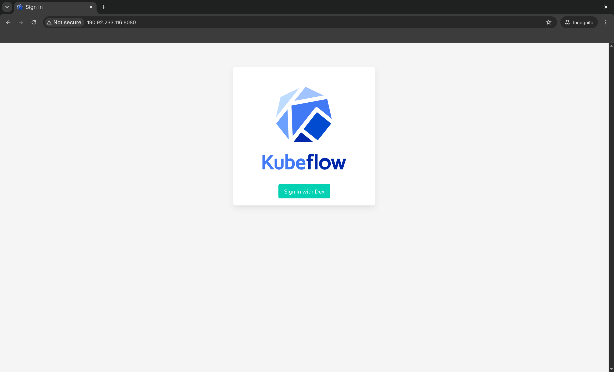
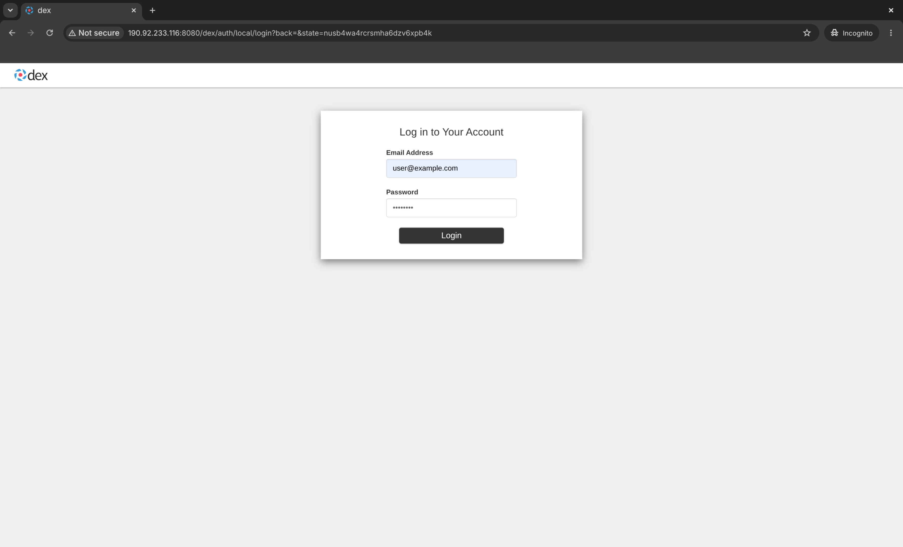
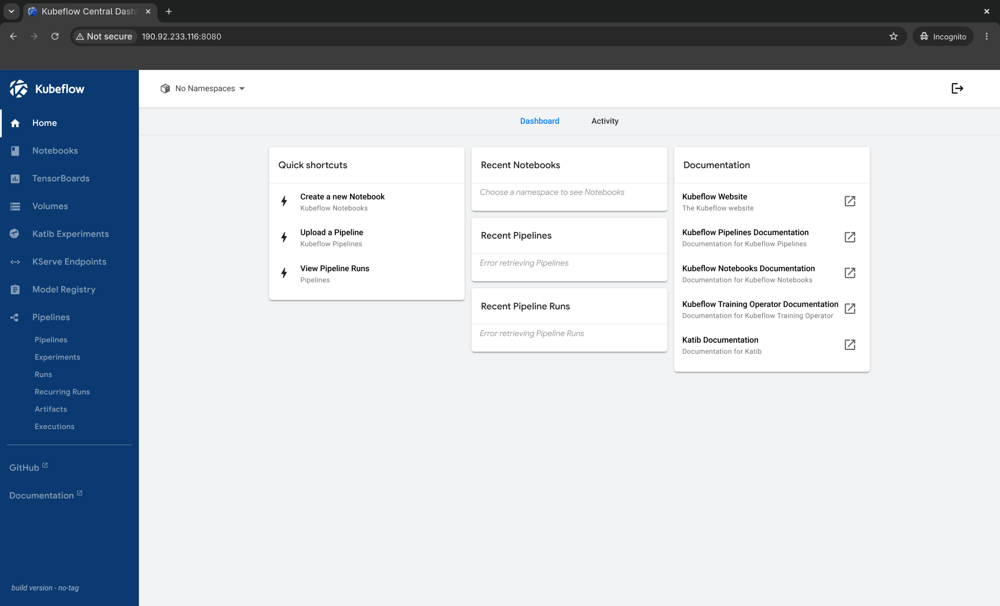

# kubeflow-gitops-demo

Bootstrap a self-service AI platform with GitOps

## Reference environment

Single-node K3s cluster on `pi2.2xlarge.4` ECS instance running on [Huawei Cloud](https://www.huaweicloud.com/intl/en-us/). The ECS instance has 8 vCPU, 32G memory, 128G system disk and 1 NVIDIA Tesla T4 datacenter GPU. Furthermore, it's assumed NVIDIA driver version 595.71.05 and CUDA version 13.2 are installed on the host.

The K3s `config.yaml` given below. Traefik ingress is disabled and the per-node pod limit is raised from 110 to 250.

```yaml
disable:
  - traefik
kubelet-arg:
  - "max-pods=250"
```

## Prerequisites

Deploy `v0.18.0` of [argoproj-labs/argocd-operator](https://github.com/argoproj-labs/argocd-operator) with `make deploy` and set the following environment variable in the operator workload.

```bash
ARGOCD_CLUSTER_CONFIG_NAMESPACES=argocd
```

Now deploy the cluster ArgoCD instance in namespace `argocd` ensuring the namespace already exists.

```yaml
---
apiVersion: argoproj.io/v1beta1
kind: ArgoCD
metadata:
  name: argocd
spec: {}
```

## Bootstrapping the self-service AI platform

Apply the Kustomize build under directory `bootstrap/overlays/v1/` to namespace `argocd`. This repository uses "app-of-apps" pattern to bootstrap the Kubeflow AI reference platform with GPU support enabled.

```bash
kubectl kustomize bootstrap/overlays/v1/ | \
    kubectl -n argocd apply -f - --server-side
```

Wait for up to 30 minutes for the platform to stabilize. Port-forward the Istio ingress gateway in namespace `istio-system` as per the official instructions under [kubeflow/community-distribution](https://github.com/kubeflow/community-distribution).

```bash
kubectl port-forward svc/istio-ingressgateway -n istio-system 8080:80
```

Now point your browser to [http://localhost:8080/](http://localhost:8080/) and login with the default credentials.

1. Username: `user@example.com`
1. Password: `12341234`

## Known issues

1. The `argocd-apps` bootstrap application may report a sync status of `Unknown` initially and fail to progress without manual intervention. Restarting the Argo CD related deployments with `kubectl rollout restart` should solve the issue
1. The Kubeflow components take about 20 minutes to stabilize. Even then, some workloads may be stuck in `CrashLoopBackOff` status and unable to progress without manual intervention. Using `kubectl rollout restart` to re-deploy these workloads often resolves the issue
1. The default user `user@example.com` cannot access the `kubeflow-user-example-com` namespace from the GUI despite the corresponding Profile being defined. As a result, the Kubeflow dashboard is unusable and workloads cannot be deployed

## Asciicast walkthrough

TODO

## Screenshots







## License

[Apache 2.0](./LICENSE)
